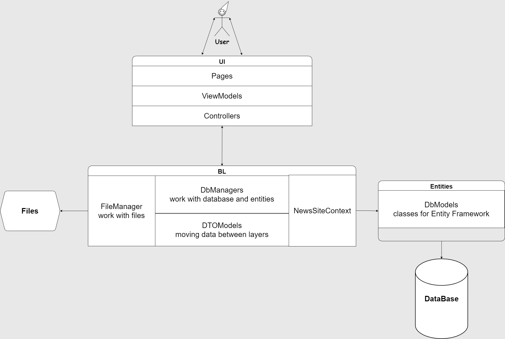

Проект новостного сайта, призванный сохранять важнейшую и полезнейшую информацию в виде новостей, а так-же позволяющий её прочитать пользователям.

## Как запустить?
Запуск происходит через создание хоста в Program и настройку в Startup .cs файлах.
Обратите внимание, что имя сервера в строке подключения (файл appsettings.json, строка Server=yourname) нужно поменять на имя того сервера, что доступен вам.
```java
  "ConnectionStrings": {
    "DefaultConnection": "Server=yourname;Database=NewsSiteDb;Trusted_Connection=True;MultipleActiveResultSets=true"
  }
```
###### Вы можете применить миграции, хранящиеся в NewsSite/NewsSite.BL/Migrations для создания базы данных, но если это не сработает, вы можете их удалить и создать свои.
## Как оно работает? (схема)
 

---
##### Слой Entities содержит исключительно классы сущностей для EF и абстракции для них. 
## Важные моменты:
---
##### HTML файлы проекта, находящиеся в wwwroot/html не могут быть использованы в работе приложения, поскольку являются вспомогательными (на их основе создаютя и редактируются .cshtml файлы).
---
##### Файл контекста (NewsSiteContext.cs) находится по пути NewsSite/NewsSite.BL/Файл контекста.

### Готовый функционал:
  - Возможность добавить новость на сайт, а так-же просмотреть содержимое имеющихся.
  - Регистрация пользователей (возможность добавления новостей только для зарегистрированых пользователей).
### Планируемый функционал:
  - Аутентификация по ролям.
  - Личный кабинет пользователя.
  - Рассылка уведомлений о новостях. 
  - Расширение тестов.
  ### Используемые языки и технологии:
  - C#.
  - HTML (скетчи страниц, не использующиеся в UI напрямую), CSS/SCSS.
  - [Razor] - UI.
  - [Entity Framework] - работа с базой данных.
  - [LINQ] - Работа с коллекциями.
  - [xUnit] - тестирование.
##### Специальные благодарности:
Помощь в разработке, тестировании и исправлении ошибок:
KurnakovMaksim - https://github.com/KurnakovMaksim

[Razor]: <https://github.com/aspnet/Razor> 
[LINQ]: <https://docs.microsoft.com/en-us/dotnet/csharp/tutorials/working-with-linq>
[Entity Framework]: <https://github.com/dotnet/efcore>
[xUnit]: <https://github.com/xunit/xunit>
